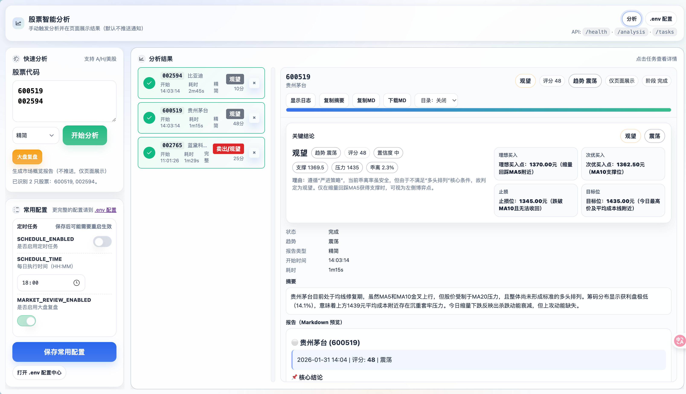
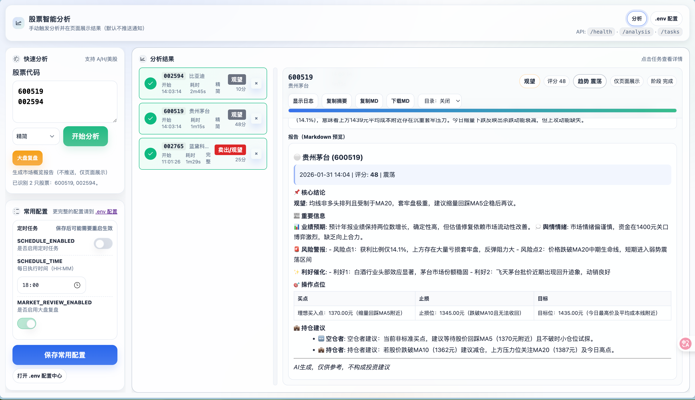

<div align="center">

# 📈 股票智能分析（WEB增强版）

本仓库是对开源项目 **[daily_stock_analysis](https://github.com/ZhuLinsen/daily_stock_analysis)** 的二次开发（Fork 增强版），主要聚焦 **本地 WebUI / 手动分析 / 结果查看 / 配置维护** 的使用体验优化。

> 定位：面向本地使用体验的 Fork 增强版（非上游官方发布）

</div>

## 🎯 适用与不适用

**适用：**
- 没有云服务器/不想公网部署，只希望在本机通过 WebUI 手动触发分析并查看结果

**不适用：**
- 主要诉求是 GitHub Actions 自动执行、定时推送、多渠道通知等“自动化运行”能力（请直接参考上游仓库文档）

## 🙏 来源与开源协议说明（请务必阅读）

- 本仓库基于上游项目 **[daily_stock_analysis](https://github.com/ZhuLinsen/daily_stock_analysis)** 二次开发而来；核心分析能力、数据源适配与推送体系来自上游实现。
- 本仓库遵循上游项目的开源许可（MIT License）：保留并沿用 `LICENSE` 中的版权声明与许可文本。
- 如上游源码文件中包含版权/许可头部声明，本仓库在修改时同样保留；并在本 README 中明确标注“本仓库新增/改造点”，便于区分上游与增强内容。

## ✅ 本仓库增强了哪些地方

本仓库的改造方向：把“自动化推送系统”补齐为“本地可交互的 WebUI 工作流”，提升日常手动分析效率。

### 🖥️ WebUI 交互与体验

- 全屏左右布局：左侧输入/配置，右侧任务列表 + 详情展示，更贴近一屏浏览
- 批量分析：输入支持逗号/空格/换行分隔，一次提交多只标的（基础限流/排队）
- 多任务管理：任务列表、详情联动；状态自动刷新
- 实时进度与日志：可展示分析步骤/日志并支持展开/隐藏，方便定位异常
- 报告展示优化：默认 Markdown 预览为浅色背景；目录（TOC）支持关闭/右上/左侧三种位置

### 🎯 结论更显眼（便于快速决策）

- 操作建议（买入/加仓/持有/减仓/卖出/观望）与趋势预测（强烈看多/看多/震荡/看空/强烈看空）使用不同颜色标记，并加粗放大
- 关键结论置顶：把“操作建议 + 趋势 + 关键价位”等核心信息抽成顶部卡片展示

### ⚙️ 配置维护（更适合无服务器场景）

- `.env` 配置中心：新增 `/env` 页面可编辑并保存 `.env` 全量内容（仅允许本机 `127.0.0.1/::1` 访问；保存自动备份）
- 首页“常用配置”：目前仅保留“定时任务”相关常用项维护入口（同样仅本机访问）
- WebUI-only 默认不启动 Stream Bot 客户端：避免未配置鉴权时反复报错刷屏
- 可选依赖降级：未安装部分第三方 SDK/库时不阻塞 WebUI-only 启动（例如飞书 SDK、dotenv、markdown2 等）

## 📸 页面截图

<div align="center">
  
  
</div>

## 🚀 快速开始（本仓库推荐：本地启动 WebUI）

如果你没有云服务器、也不准备做公网访问/域名/HTTPS，建议按本仓库的本地 WebUI 方式使用。

### 1) 创建虚拟环境并安装依赖（示例）

```bash
python3 -m venv .venv
./.venv/bin/python -m pip install -U pip
./.venv/bin/python -m pip install -r requirements.txt
```

### 2) 启动 WebUI

强烈建议使用明确解释器（避免 Python / pip 串环境）：

```bash
./.venv/bin/python main.py --webui-only
```

访问地址：`http://127.0.0.1:8000`

## 🔌 WebUI API

| 接口 | 方法 | 说明 |
|------|------|------|
| `/` | GET | WebUI 首页（分析/任务/详情） |
| `/env` | GET | `.env` 配置中心（仅本机访问） |
| `/health` | GET | 健康检查 |
| `/analysis?code=xxx` | GET | 触发单只股票异步分析 |
| `/market-review` | GET | 触发大盘复盘异步任务（WebUI 按钮使用） |
| `/tasks` | GET | 查询任务列表 |
| `/task?id=xxx` | GET | 查询单个任务 |
| `/env/update` | POST | 保存 `.env`（仅本机访问） |
| `/common/update` | POST | 保存“常用配置”（当前仅定时任务项；仅本机访问） |

## 📁 项目结构（简要）

```
daily_stock_analysis/
├── main.py              # 主程序入口
├── webui.py             # WebUI 入口
├── src/                 # 核心业务代码
├── web/                 # WebUI 模块
└── .github/workflows/   # GitHub Actions（上游能力，保留）
```

## 📄 License

本仓库遵循上游项目的 MIT License（见 `LICENSE`）。如你基于本仓库继续二次开发，请保留许可与来源声明。

## ⚠️ 免责声明

本项目仅供学习和研究使用，不构成任何投资建议。股市有风险，投资需谨慎。作者不对使用本项目产生的任何损失负责。
